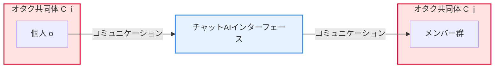
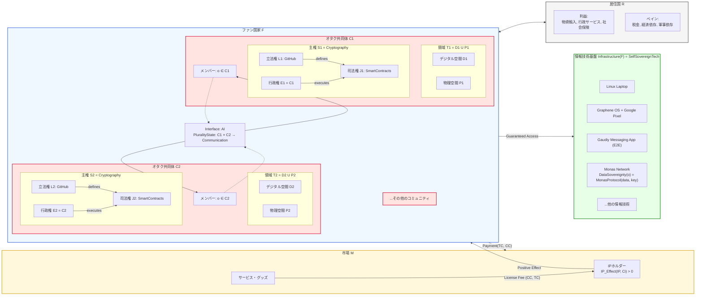

## 定義

### 基本集合の定義
- $F$: ファン国家 (Fandom) 全体を表す集合
- $C = \{C_1, C_2, \dots, C_n\}$: ファン国家を構成する、個別のオタク共同体の集合
- $O = \{o_1, o_2, \dots, o_m\}$: すべてのオタク個人の集合
- $R$: ファン国家が物理的に存在する居住国
- $M$: 市場

### 1. オタクの広義定義
$$
\text{Otaku} = \{o \in O \mid \exists \text{topic} \in \text{Topics}, \text{hasOtakuNess}(o, \text{topic})\}
$$
- 「オタク」とは、何らかのトピックに対してオタク性を持つ個人の集合として広義に定義

$$
\text{hasOtakuNess}: O \times \text{Topic} \to \{\text{True, False}\}
$$
- 個人 $o$ とトピックのペアを受け取り、その個人がそのトピックにオタク性を持つかどうかを真偽値で返す述語関数
- オタク共同体はあらゆるオタクに対する研究室や同好会と言い換えることができる

### 2. オタク共同体の定義
$$
\forall i, C_i = \{o \in O \mid \text{hasOtakuNess}(o, \text{topic}_i)\}
$$
- 各オタク共同体 $C_i$ は、特定のトピック $\text{topic}_i$ に対して「オタク性」を持つ個人の集合

### 3. ファン国家とオタク共同体の関係
$$
F \supset C
$$
- ファン国家 $F$ が、すべてのオタク共同体 $C$ を含む上位集合

$$
\forall C_i \in C, C_i \subset F
$$
- 任意のオタク共同体 $C_i$ が、ファン国家 $F$ の部分集合

### 4. 主権と領域の分散
$$
\forall C_i \in C, \text{Sovereignty}(C_i) = \text{Cryptography}
$$
- すべてのオタク共同体 $C_i$ の主権は、暗号技術によって保証される独立したもの
  - この考えはアーミッシュをきっかけにした中庸メノナイトとサイファーパンク思想からの影響を受けている

$$
\forall C_i \in C, T_i = D_i \cup P_i
$$
- 各共同体 $C_i$ の領域 $T_i$ は、デジタル空間 $D_i$ と物理空間 $P_i$ の和集合

### 5. 三権分立
$$
\forall C_i \in C,
\begin{cases}
L_i = \text{GitHub} \\
E_i = C_i \\
J_i = \text{Law}(\text{SmartContracts}_{C_i})
\end{cases}
$$
- 各共同体 $C_i$ の独立した三権分立。立法権 $L_i$ はGitHub、行政権 $E_i$ は共同体メンバー全員、司法権 $J_i$ はスマートコントラクトの集合として定義される法律（コード）が担う

### 6. 情報技術インフラストラクチャ
$$
\text{Infrastructure}(F) = \text{InformationSystems}
$$
- ファン国家 $F$ の社会インフラは、情報技術システムによって構成

$$
\text{InformationSystems} = \{\text{DataManagement}, \text{KeyManagement}, \text{Wallets}, \text{OS}, \\ \text{Messaging}, \text{Laptop}, \text{SmartPhone}, \dots, etc. \}
$$

#### 各システムの特性定義例:
- **データ管理 (Monas Network)**: 

  $$
  \forall o \in O, \text{DataSovereignty}(o) = \text{Monas}(\text{data}_o, \text{key}_o)
  $$

  すべてのオタク個人 $o$ のデータ主権は、自身のデータと鍵を用いてMonas Network上で管理・制御できることを保証する

  - データ主権 (Data Sovereignty)
  - 機密性 (Confidentiality): 暗号化による保護
  - データ完全性 (Data Integrity): ハッシュ検証
  - 可用性 (Availability): 分散ストレージ
  - 匿名性 (Anonymity): 公開鍵暗号
  - 永続性 (Permanence): 分散ストレージ
  - ポータビリティ (Portability): 特定のサービスに縛られないGoogleやAppleのログイン機能を持たないNS
  - 検証可能性 (Verifiability)
  - 真正性（Authenticity）

- **鍵管理 (Key Management)**:
  - 機密性: ハードウェアセキュリティモジュール
  - 完全性: デジタル署名
  - 非否認性 (Non-repudiation): 公開鍵基盤

- **ウォレット (Wallets)**:
  - コールドウォレット: 生存性 (Survivability)、耐タンパー性，非可用性
  - ホットウォレット: 可用性、利便性

- **OS**:
  - Graphene OS:
    - 安全性 (Security): サンドボックス化
    - プライバシー: 追跡防止
    - 完全性: OSが改竄されないことの証明（署名検証）
  - Linux:
    - 柔軟性・カスタマイズ性: 用途に応じた最適化が可能
    - オープンソース: 高い透明性とコミュニティによる監査
    - 多層防御: SELinux/AppArmorなどによる強制アクセス制御
    - 監査可能性 (Auditability)
    - 拡張性（Modularity）

- **ハードウェアセキュリティ (Hardware Security)**:
  - Google Pixel:
    - OSの完全性の保証: 強固な検証済みブート (Verified Boot)
    - セキュリティチップ: Titan M2

- **ブラウザ (Browsers)**:
  - Brave, Vivaldi, Firefox:
    - プライバシー保護: 追跡防止、広告ブロック
    - 安全性: 悪意のあるサイトからの保護

- **検索エンジン (Search Engine)**:
  - DuckDuckGo:
    - プライバシー: ユーザープロファイルの非作成、検索履歴の非保存

- **通信経路 (Communication Path)**:
  - Tor, VPN, メッシュネットワーク:
    - 匿名性 (Anonymity): 誰がどこにアクセスしているかを隠蔽し、監視から保護
    - 耐検閲性 (Censorship Resistance): 特定の政府や組織による情報アクセスへの妨害を回避し、自由な情報流通を確保

- **メッセージング (Messaging)**:
  - Gaudiy Messaging App:
    - 機密性: E2E暗号化
    - 完全性: メッセージ認証
    - 匿名性: メタデータ保護

- **通貨（currency）**:
  - 暗号通貨，ビットコイン:
    - パブリックパーミッションレスブロックチェーン  
      - 一貫性（Consistency）
      - 永続性（Durability）
      - 可用性（Availability）
      - 透明性（Transparency）
      - 完全性（Integrity）
      - 真正性（Authenticity）
      - 観測可能性（observability）
      - 検証可能性（verifiability）
      - 契約当事者関係（privity）
      - 強制力（enforceability）
      - 耐改竄性 (Immutability)
      - 分散性 (Decentralization)
      - 耐検閲性（Censorship Resistance）
      - コンセンサスプロトコル:
        - 生存性(liveness)
        - 安全性(Safety)

- **AIインターフェース (AI Interface)**:
  - 連合学習・分散機械学習AI:
    - プライバシー: 元データを移動させずに学習
    - 可用性: 単一障害点のないモデル

- **エネルギー源 (Energy Source)**:
  - 太陽光エネルギー → 核融合エネルギー:
    - 持続可能性: クリーンなエネルギー
    - 自給率: 外部依存からの脱却

$$
\forall o \in O, \forall t \in \text{InformationSystems}, \text{Access}(o, t) = \text{Guaranteed}
$$
- Fairness: すべてのオタク個人 $o$ が、情報技術システムのすべての要素 $t$ に対して公平なアクセスが保証される

### 7. 経済関係
$$
\text{Payment}: F \to M \text{ via } \{TC, CC\}
$$
- ファン国家 $F$ が市場 $M$ に対して、フィアット通貨 (TC) と暗号資産 (CC) を用いて支払う

$$
\forall IP \in M, \forall C_i \in C, \text{IP Effect}(IP, C_i) > 0
$$
- 市場 $M$ に存在するすべてのIPが、任意のオタク共同体 $C_i$ に対して与える正の（プラスの）効果

### 8. 居住国との関係
$$
\text{Dependencies}(F, R) = \text{Benefits} \cup \text{Costs}
$$
- ファン国家 $F$ の居住国 $R$ に対する依存関係は、利益 (Benefits) とペイン (Pains / Costs) の和集合
  - **Benefits**:  $\{Economic Security, Import of Goods, Administrative Services, Social Insurance, \dots, etc\}$
    - 経済安全保障, 物資輸入, 行政サービス, 社会保険など
  - **Pains / Costs**:  $\{Taxes, Economic Dependence, Military Dependence, \dots, etc\}$
    - 税金, 経済依存, 軍事依存など

Note: ファン国家では小さな政府であることが望ましい

## インターフェース

- オタク共同体 $C_i$ に属する個人 $o$ が、別のオタク共同体 $C_j$ とコミュニケーションを行う際、従来のメッセージングアプリに代わり、チャット形式のAIインターフェースを利用する。
- このインターフェースを介したコミュニケーション中は、常に **Plurality（多元性）** の特性が満たされる状態となる。これはコミュニケーション自体が持つ性質である。

## ファン国家アーキテクチャ

